# Denis Bukva Task - 2

## Level0

- Commands used:

  - `ssh bandit0@bandit.labs.overthewire.org -p 2220`

  - 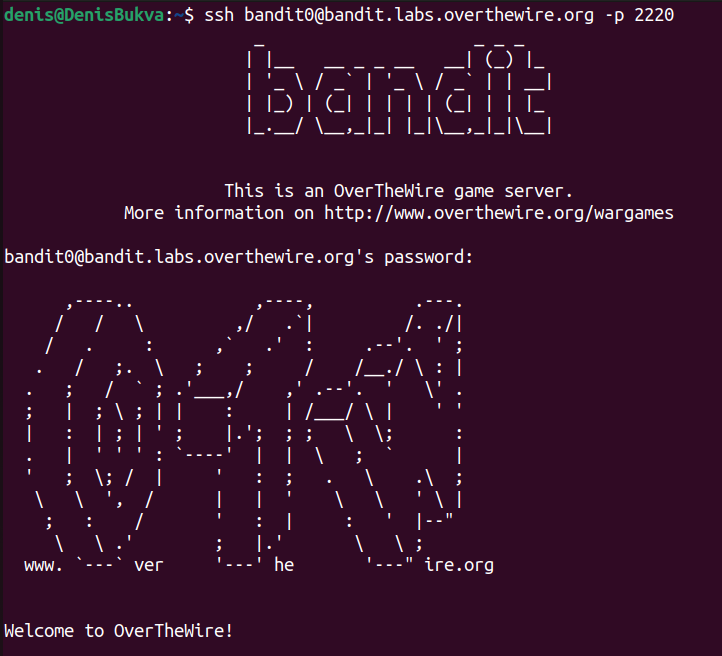

## Level0 - Level1

- Commends used:
  - `ls`- list files
  - `cat readme` - to view the content of `readme` file
  - `exit` - to logout
  - `ssh bandit1@bandit.labs.overthewire.org -p 2220`
  - 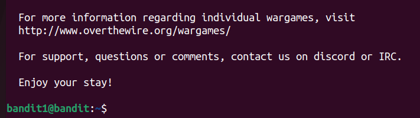

## Level1 - Level2

- Command used:
  - `pwd` - to see where am I
  - `ls -la` - list all files
  - `cat ./-` - to see contents in `-` file
  - `exit` - to logout
  - 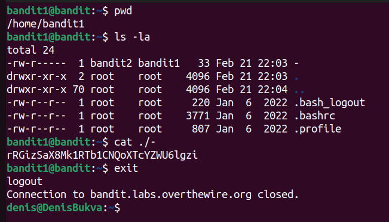

## Level2 - Level3

- Command used:
  - `ssh bandit2@bandit.labs.overthewire.org -p 2220`
  - `ls` - to see file
  - `cat "spaces in this filename"` - to view the content of `space in this filename` file
  - `exit` - logout
  - 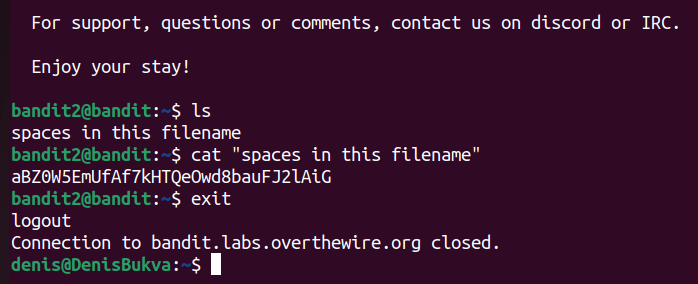

## Level3 - Level4

- Command used:
  - `ssh bandit3@bandit.labs.overthewire.org -p 2220`
  - `ls` - to see the dir
  - `cd inhere` - go to inhere dir
  - `ls -la` - see all the files
  - `cat .hidden`
  - `exit`
  - 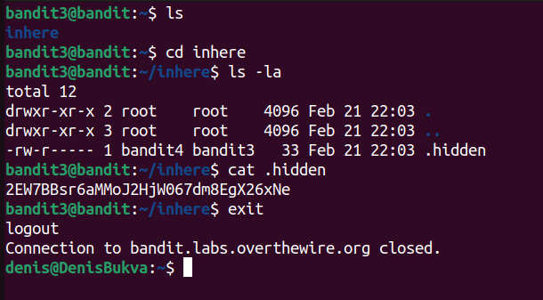

## Level4 - Level5

- Command used:
  - `ssh bandit4@bandit.labs.overthewire.org -p 2220`
  - `ls`
  - `cd inhere` - go to inhere dir
  - `ls -la` - see all files
  - `file ./*` - check file type
  - `cat ./-file07`
  - `exit`
  - 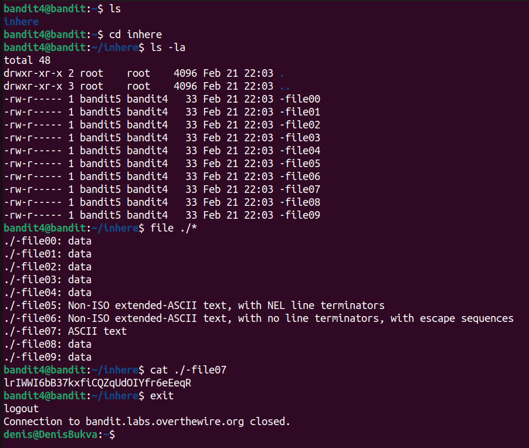

## Level5 - Level6

- Command used:
  - `ssh bandit5@bandit.labs.overthewire.org -p 2220`
  - `ls`
  - `cd inhere`
  - `ls` - to see dir
  - `pwd` - to see where am I
  - `find /home/bandit5/inhere -type f -readable -size 1033c ! -executable`
  - `cd maybehere07`
  - `ls`
  - `ls -la`
  - `cat .file2`
  - 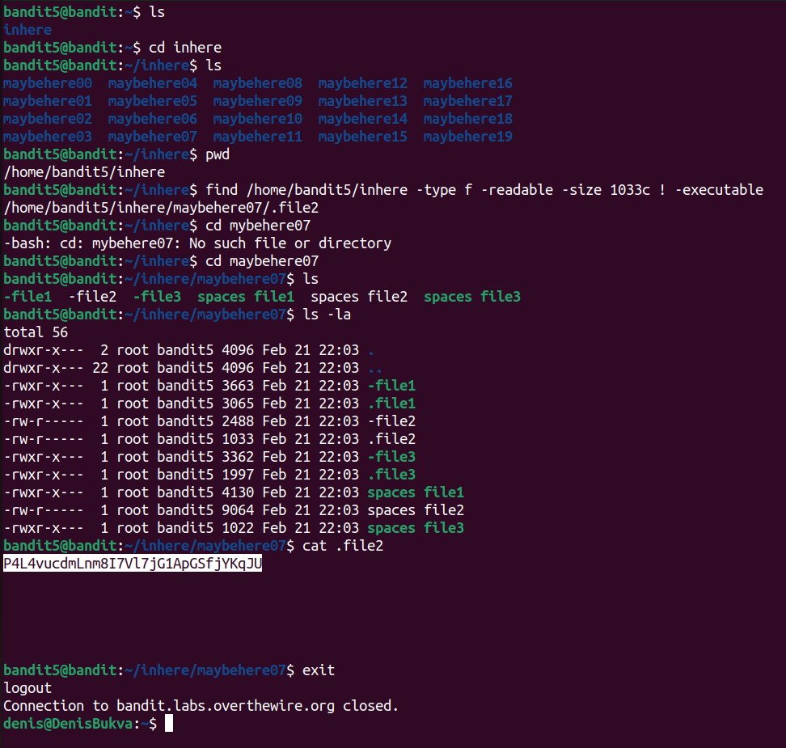

## Level6 - Level7

- Command used:
  - `ssh bandit6@bandit.labs.overthewire.org -p 2220`
  - `find / -type f -user bandit7 -group bandib6 -size 33c`
  - `cat /var/lib/dpkg/info/bandit7.password`
  - `exit`
  - 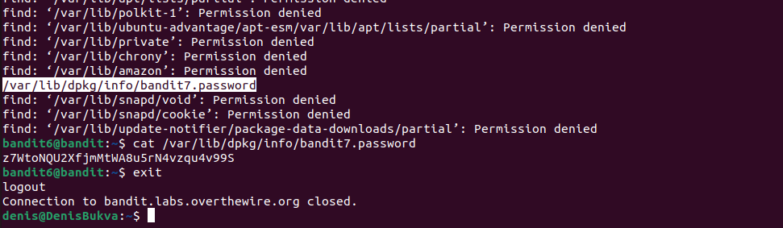

## Level7 - Level8

- Command used:
  - `ssh bandit7@bandit.labs.overthewire.org -p 2220`
  - `ls` - list file
  - `grep "millionth" data.txt`
  - `exit`
  - 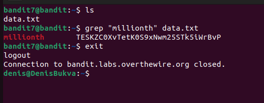

## Level8 - Level9

- Command used:
  - `ssh bandit8@bandit.labs.overthewire.org -p 2220`
  - Googled `the only line of text that occurs only once linux`:
    - `cat data.txt | sort | uniq -u` - First way
    - `sort data.txt | uniq -u` - Better solution in my opinion
  - `exit`
  - 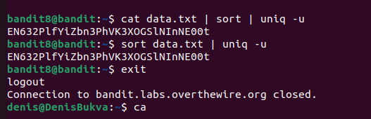

## Level9 - Level10

- Command used:
  - `ssh bandit9@bandit.labs.overthewire.org -p 2220`
  - `ls` - see files
  - `cat data.txt` - see content of data.txt
  - `grep "===*" data.txt` - binary file matches
  - `strings data.txt | grep "=="` - List all strings of characters from the binary file "data.txt" And then with the grep command we filter all lines containing the string "=="
  - `exit`
  - 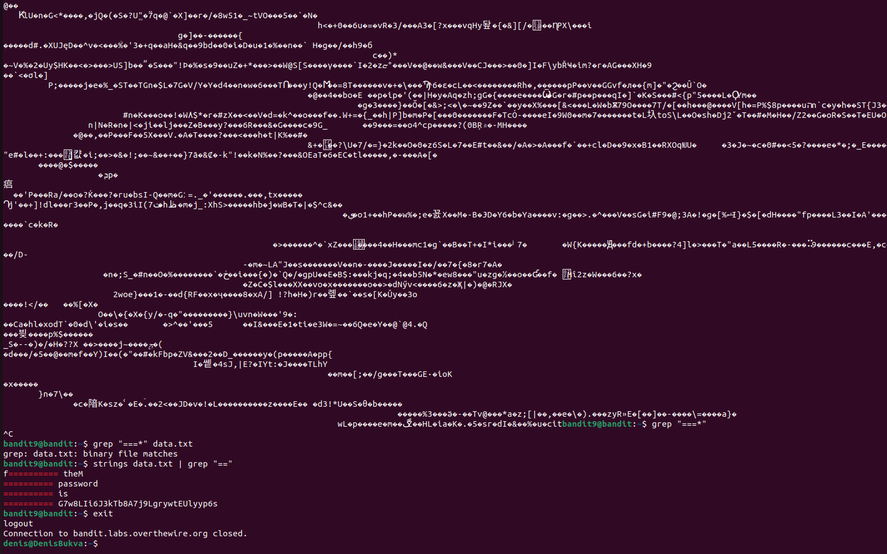

## Level10 - Level11

- Command used:
  - `ssh bandit10@bandit.labs.overthewire.org -p 2220`
  - `ls`
  - Read how to decode base64
  - `base64 --decode data.txt` - decode the base64 data in the file
  - `exit`
  - 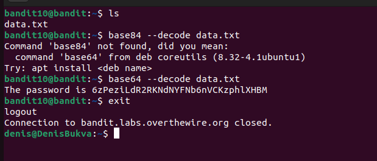
