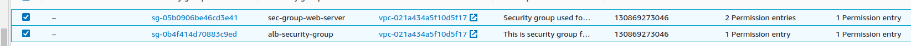

## Week 8 Denis BUkva

## Screenshots related to task completion:

### 1 - AMI image

### 2 - Kreiran ALB koji je povezan sa target grupom

### 3 - Kreiran ASG

### 4 Skaliranje

### 5 Dijagram infrastrukture

### 6 Sec groups

### 7 DNS Name
- `alb-web-servers-1304028128.eu-central-1.elb.amazonaws.com`