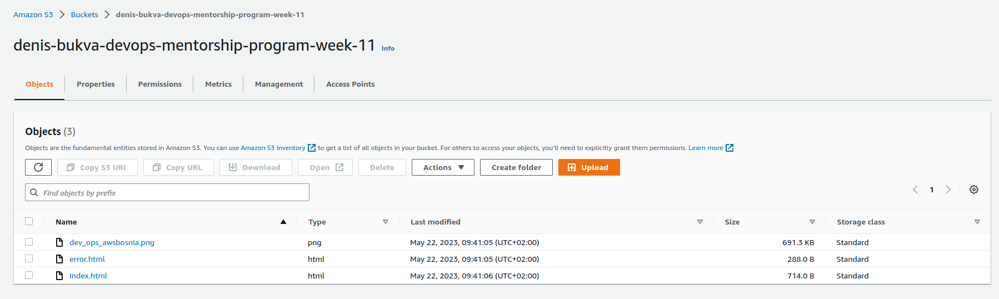
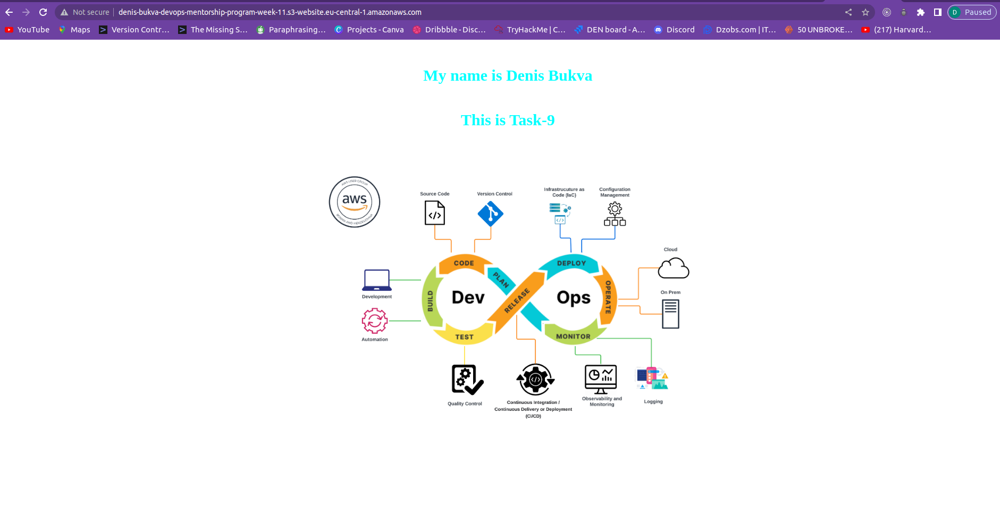
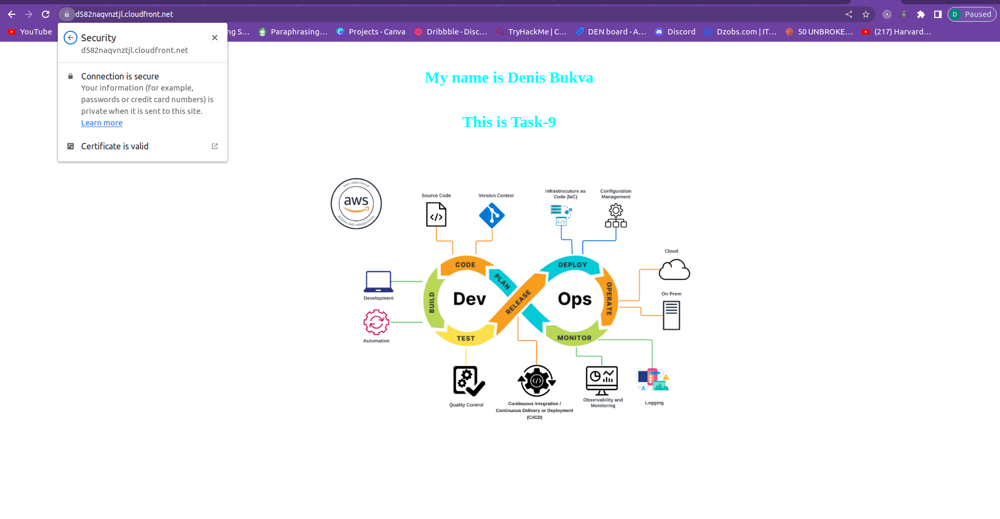
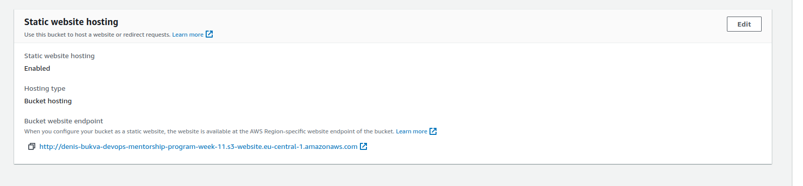
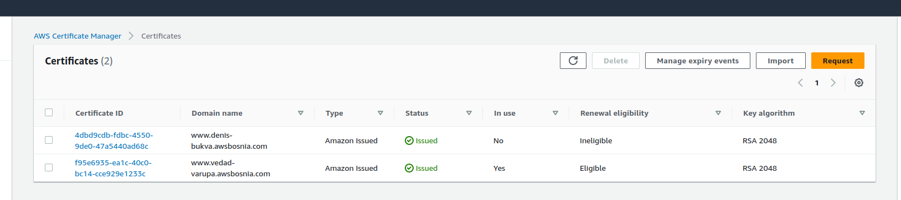

## TASK-9 solution

- S3 bucket

- S3 website endpoint screenshot

- Distribution endpoint screenshot

- Static website hosting

- Certifikat

- Final version

## TASK-9 commands

- Route 53 configuration:
    - `aws route53 change-resource-record-sets --hosted-zone-id Z3LHP8UIUC8CDK --change-batch '{"Changes":[{"Action":"CREATE","ResourceRecordSet":{"Name":"www.denis-bukva.awsbosnia.com","Type":"CNAME","TTL":60,"ResourceRecords":[{"Value":"d582naqvnztjl.cloudfront.net"}]}}]}'` 
- To check DNS propagation:
    - `aws route53 list-resource-record-sets --hosted-zone-id Z3LHP8UIUC8CDK | jq '.ResourceRecordSets[] | select(.Name == "www.denis-bukva.awsbosnia.com.") | {Name, Value}'`

## TASK-9 endpoints

- S3 website endpoint - non-encrypted
    - `http://denis-bukva-devops-mentorship-program-week-11.s3-website.eu-central-1.amazonaws.com`
- CloudFront distribution endpoint - encrypted
    - `https://d582naqvnztjl.cloudfront.net`